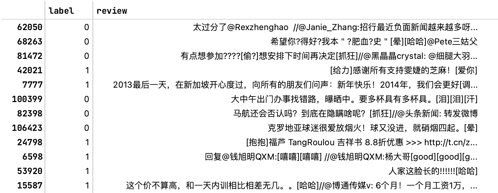
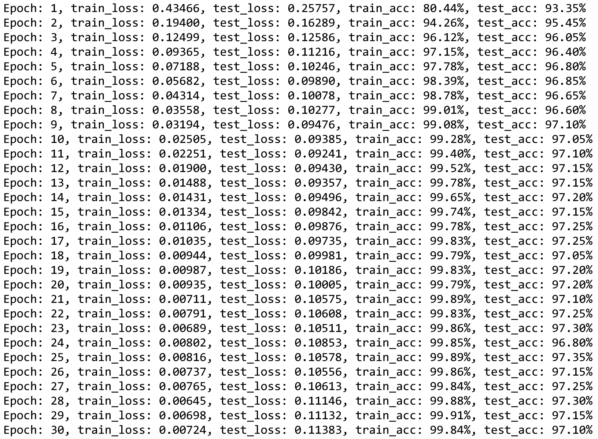
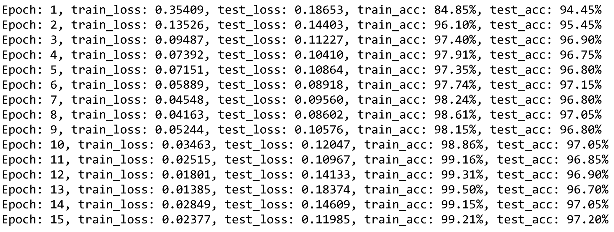

# **情感分析报告**

- 文本情感分析主要应用于用户情感信息获取、舆情控制、产品推荐等方面，是指对带有情感色彩的主观性文本进行采集、处理、分析、归纳和推理的过程，涉及到人工智能、机器学习、数据挖掘、自然语言处理等多个研究领域。
根据使用的不同方法，将其划分为基于情感词典的规则方法、传统的统计学习方法、基于深度学习的情感分类方法。通过对这三种方法进行对比，并对不同方法的优缺点进行归纳。
## **1 研究进展**
### **1.1 基于情感词典的规则方法**
基于情感词典的方法，是指根据不同情感词典所提供的情感词的情感极性，来实现不同粒度下的情感极性划分，该类方法维护一个语料库，其中每个正面和负面词都被分配一个情绪值。然后，使用情感值的总和或平均值来计算整个句子或文档的情感。

基于情感词典的方法可以准确反映文本的非结构化特征，易于分析和理解。在这种方法中，当情感词覆盖率和准确率高的情况下，情感分类效果比较准确。

但这种方法仍然存在一定的缺陷：该方法主要依赖于情感词典的构建，对于许多类似于歇后语、成语或网络特殊用语等新词的的识别效果不好，现有的情感词典需要不断地扩充才能满足需要；情感词典中的同一情感词可能在不同时间、不同语言或不同领域中所表达的含义不同，在跨领域和跨语言中的效果不是很理想；在使用情感词典进行情感分类时，往往考虑不到上下文之间的语义关系。

Rajib等人通过与机器学习分类器比较，可以看出他们系统的效率和性能都好很多，得益于他们自建的情感词词典[1] 。但是词典不进行定期的扩充整理，那么它的效果还是会逐渐下降。

### **1.2 传统的统计学习方法**
机器学习是一种通过给定的数据训练模型，通过模型预测结果的一种学习方法。该方法研究至今，已经取得了诸多有效的成果。

基于机器学习的情感分析方法是指通过大量有标注的或无标注的语料，使用统计机器学习算法，抽取特征，最后在进行情感分析输出结果。

基于机器学习的情感分类方法主要分为三类：监督、半监督和无监督的方法。

在有监督方法中，通过给定带有情绪极性的样本集，可以分类得到不同的情感类别。有监督的方法对数据样本的依赖程度较高，在人工标记和处理数据样本上花费的时间较多。常见的有监督的方法有：KNN、朴素贝叶斯、SVM。

在半监督方法中，通过对未标记的文本进行特征提取可以有效地改善文本情感分类结果，这种方法可以有效解决带有标记的数据集稀缺的问题。

在无监督方法中，根据文本间的相似性对未标记的文本进行分类，这种方法在情感分析中使用较少。

Shivangi等人针对多类文本情感分类问题提出了一种基于集成分类器的方法。该集成是使用4个不同的分类器创建的，包括朴素贝叶斯、多类 SVM、逻辑回归和SGD在Bagging、Boosting和Voting三种算法下，以构成一个结合了基分类器优点的有前途的模型[2] 。最终证明了集成学习方法有相当大的性能提升，因此在情绪分类研究中具有潜在的适用性。

支持向量机可以对一些常用的情感表达进行分类。评估是根据测量的准确度、精密度和召回率设置的。一种改进的情绪分析方法与先进的预处理被证明可以提供更好的结果。CAI等[3]提出了一个三层情感词典，它可以将情感词与对应的实体和方面联系在一起，减少情感词的多重含义。该模型从情绪动态特征的描述和计算出发，更全面地预测了描述情绪演化的过程特征。

Kamal等[4]提出了一种基于规则和机器学习相结合的方法来识别用户评价中的特征‒意见对及其情感极性，实现对不同电子产品的情感极性划分。Xue等[5] 分析2020年3月7日到2020年4月21日期间与新冠病毒相关的2200万条Twitter 消息，使用了包括“冠状病毒”“ 隔离”等 20 个标签，通过LDA 模型突出主题以及推文中的情感，实现了对公众情绪变化的快速追踪。

基于传统机器学习的情感分类方法主要在于情感特征的提取以及分类器的组合选择，不同分类器的组合选择对情感分析的结果有存在一定的影响，这类方法在对文本内容进行情感分析时常常不能充分利用上下文文本的语境信息，存在忽略上下文语义的问题，因此其分类准确性有一定的影响。
### 1.3 **基于深度学习**
基于深度学习的情感分析方法是使用神经网络模型来进行的，典型的神经网络学习方法有：卷积神经网络（Convolutional Neural Network，CNN）、递归神经网络 （Recurrent Neural Network，RNN）、长短时记忆（Long Short-Term Memory，LSTM）网络等。

2018 年由GoogleAI研究院推出的预训练模型 BERT 模型。BERT的本质上是通过在海量的语料的基础上运行自监督学习方法为单词学习提供一个好的特征表示，供其他任务迁移学习的模型，该模型可以根据任务微调或者固定之后作为特征提取器。BERT的网络架构使用的是多层 Transformer 结构，有效的解决了NLP中棘手的长期依赖问题，BERT 还使用更强大的机器训练更大规模的数据，使BERT的结果达到了全新的高度。

主要分为：

单一神经网络的情感分析：2003年Bengio等人提出了神经网络语言模型，该语言模型使用了一个三层前馈神经网络来建模。神经网络主要由输入层、隐藏层、输出层构成。

语言模型的本质就是根据上下文信息来预测下一个词的内容，而不依赖人工标注语料，由此可以发现语言模型的优势就是能从大规模的语料中学习丰富的知识。这种方法能够有效解决基于传统情感分析方法中忽略上下文语义的问题。

②混合神经网络的情感分析：除了对单一神经网络的方法的研究之外，有不少学者在考虑了不同方法的优点后将这些方法进行组合和改进，并将其用于情感分析方面。

和使用基于情感词典和传统机器学习的情感分析方法相比，采用神经网络的方法在文本特征学习方面有显著优势，能主动学习特征，并对文本中的词语的信息主动保留，从而更好地提取到相应词语的语义信息来有效实现文本的情感分类。

③引入注意力机制的情感分析：在神经网络的基础上，2006 年，Hinton等人率先提出了深度学习的概念，通过深层网络模型学习数据中的关键信息，来反映数据的特征，从而提升学习的性能。

基于深度学习的方法是采用连续、低维度的向量来表示文档和词语，因此能有效解决数据稀疏的问题；此外，基于深度学习的方法属于端到端的方法，能自动提取文本特征，降低文本构建特征的复杂性。

通过在深度学习的方法中加入注意力机制，用于情感分析任务的研究，能够更好地捕获上下文相关信息，提取语义信息，防止重要信息的丢失，可以有效提高文本情感分类的准确率。

④使用预训练模型的情感分析：预训练模型是指用数据集已经训练好的模型。通过对预训练模型的微调，可以实现较好的情感分类结果，因此最新的方法大多使用预训练模型，最新的预训练模型有：ELMo、BERT、XL-NET、ALBERT等。

通过和传统方法相比，使用语言模型预训练的方法充分利用了大规模的单语语料，可以对一词多义进行建模，使用语言模型预训练的过程可以被看作是一个句子级别的上下文词表示。

通过对大规模语料预训练，使用一个统一的模型或者将特征加到一些简单的模型中，在很多NLP任务中取得了不错的效果，说明这种方法在缓解对模型结构的依赖问题上有明显的效果。

近年来，有不少学者对基于深度学习的情感分类方法进行研究。Mounika等人研究了基于深度学习的长短期记忆机制在文本情感识别中的有效性。实验结果证明，基于LSTM的文本情感分类提供了相对更高的准确度[6] 。Mansur研究了三种不同的深度学习架构，包括人工神经网络 (ANN)、卷积神经网络(CNN)和具有长短期记忆(LSTM) 的循环神经网络(RNN)。其中ANN 对情绪的结果判断中效果最差，而CNN是最好的。Achea等人分析了BERT、 RoBERTa、DistilBERT和XLNet预训练的Transformer模型在识别文本情感方面的功效，进一步证明了RoBERTa在识别ISEAR数据集上的情绪方面优于其他候选模型的功效[7] 。Yinhan Liu, Myle Ott等人[8]发现BERT训练不足，并且可以匹配或超过其后发布的每个模型的性能，模型在GLUE、RACE和SQuAD上取得了最先进的结果。

Chen等[9]首次提出双输入门控循环单元处理各模态的噪音数据，通过时间注意门控嵌入的多模态LSTM模型对各模态特征在单词级进行混合融合。Gunes等[10]对在线视频进行多模态情感分析，将视频中的面部表情和手势进行特征级融合，而后将分析结果加权进行决策级融合，得到融合结果，最后进行情感极性的判断。杨晓翠、冯时等人[11]用少量的有标签的多模态数据进行执行三个与MABSA相关的任务。为了在小样本场景中捕获每个方面项的特定提示，他们为MABSA任务提出了一种新颖的生成式的多模态提示（GMP）模型，其中包括多模态编码器模块和N-Stream解码器模块，进一步引入了一个子任务来预测每个实例中方面项的数目，从而构建多模态提示。

Wang等[12]最早将注意力机制引入情感分析任务，提出了一种使用目标嵌入的基于注意力的LSTM 模型。该模型在SemEval 2014数据集上取得了很好的结果，表明注意力机制在解决ABSA问题上有很大的优势。Liu等[13]通过区分给定目标的左上下文和右上下文获得的注意力来扩展注意力模型，通过关注每个词对目标的贡献，在T-Dataset数据集和 Z-Dataset上的准确率与以往方法相比均有显著的提升。Ma等[14]提出了一种既考虑目标注意力又考虑上下文注意力的交互式注意力网络（IAN），使用两个注意力网络交互式检测目标描述的重要单词和整个上下文的重要单词。曹卫东等[15]提出了一种用于目标情感分析的注意力门控卷积网络模型，通过多头注意力机制加强上下文和目标词之间的交互，在SemEval 2014 Task4的餐厅和笔记本电脑数据集上得到了较高的准确率。Yang等[16]首次提出了一种协同注意力机制的方法，该方法将目标级和上下文级的注意力交替建模，以聚焦目标的关键词，学习更有效的上下文表征，为进一步利用注意机制和深度神经网络进行基于方面的情感分析提供了新的思路。针对情感词典不能考虑目标词上下文语义信息，以及完整句子序列信息易受梯度消失或梯度爆炸限制等问题。陈珂等[17]提出了一种基于情感词典和Transformer的文本情感分析方法，该方法不仅可以充分利用情感词典的特征信息，还可以将与情感词相关联的其他词整合到情感词表示中。此外，该方法还能够更专注于情感词的不同位置，更好地理解输入句子的单词顺序和表示词与词之间的距离。Zhouhan Lin, Minwei Feng等人[18]通过引入自我注意来提取可解释句子嵌入的新模型。

Iulia Turc、 Ming-Wei Chang等人[19]表明预训练在较小架构的背景下仍然很重要，并且微调预训练的紧凑模型可以与并发工作中提出的更精细的方法竞争。李波波、费豪等人[20]首次提出了对话场景下的方面级情感四元组分析任务，并标注了包含中英文双语的大规模数据集，并提供了一个基于词对关系建模的基线模型，从而填补了对话场景下观点挖掘和细粒度情感分析的空白，也为情感分析领域的研究提出了新的挑战。


## **2 实现过程**

### 2.1 数据集选取

本实验数据集选取中文微博数据集 `weibo_senti_100k`，内含10万余条带情感标注的新浪微博评论，正负向评论约各5万条。数据集包含两个字段：label字段中1表示正向评论，0表示负向评论；review字段中内容为微博评论内容



本实验从10万条数据中随机抽取1万条进行实验

### 2.2 数据预处理

处理数据包括一下步骤：

1. 数据清洗：去除用户名、特殊字符以及非中文字符串（如网站链接）等无用信息
2. 分词处理：使用jieba库进行分词
3. 去除停用词

```python
def data_cut(self, review):
    index = 0
    review_cut = []
    for item in review:
        # 删除用户名
        item = re.sub('@.*?:', '', item)
        item = re.sub('@.*?：', '', item)
        # 删除特殊字符
        item = re.sub(r'\W+', ' ', item).replace('_', ' ')
        # 分词
        cut = jieba.lcut(item)
        segResult = []
        # 判断非中文字符串如链接等
        for word in cut:
            if ('\u4e00' <= word <= '\u9fa5'):
                segResult.append(word)
        review_cut.append(' '.join(segResult))
        index += 1
    return review_cut
```

### **2.3 基于情感词典进行情感分析**
#### 2.3.1 **加载词典**
- 本实验选取两种类型的词典。
  1. BonsonNLP情感词典：该情感词典包含了一系列中文词汇以及它们的情感强度分值，范围是0到1，表示该词汇在情感方面的程度。例如，一个词汇的情感分值为 0.8，表示该词汇在情感方面非常积极。
  2. 台湾大学NTUSD简体中文情感词典：该词典划分为正向情感词汇 `ntusd-positive.txt`和负向情感词汇 `ntusd-negative.txt`
- 加载其他预定义的词典，包括程度副词词典，否定词词典，以及停用词词典。
  - 程度副词词典来自于知网HowNet，该词典将程度副词分为六个级别，并分别赋值1.8、1.6、1.5、0.8、0.7、0.5，用于后续情感得分计算。
  - 停用词词典使用哈工大停用词表

```python
def load_dict(self, request):
    path = './dictionary/'
    if request == 'degree':
        degree_file = open(path + 'degree.txt', 'r+')
        degree_list = degree_file.readlines()
        degree_dict = defaultdict()
        for i in degree_list:
            degree_dict[i.split(',')[0]] = float(i.split(',')[1])
        return degree_dict
    elif request == 'sentiment':
        with open(path + 'sentiment_score.txt', 'r+') as f:
            sen_list = f.readlines()
            sen_dict = defaultdict()
            for i in sen_list:
                if len(i.split(' ')) == 2:
                    sen_dict[i.split(' ')[0]] = float(i.split(' ')[1])
        return sen_dict
    elif request == "positive":
        file = open(path + "positive_simplified.txt")
    elif request == "negative":
        file = open(path + "negative_simplified.txt")
    elif request == "inverse":
        file = open(path + "inverse_words.txt")
    elif request == 'stopwords':
        file = open(path + 'stopwords.txt')
    else:
        return None
    dict_list = []
    for word in file:
        dict_list.append(word.strip())
    return dict_list
  
if dict_choice == 'Boson':
    self.sentiment_dict = self.load_dict('sentiment')
elif dict_choice == 'NTUSD':
    self.positive_words = self.load_dict('positive')
    self.negative_words = self.load_dict('negative')
```

#### 2.3.2 **情感分类**
> 根据情感词典，程度副词，否定词等对文本进行情感分类。对于每个词，如果它在正面情感词列表中，就增加分数；如果在负面情感词列表中，就减少分数。同时，对于前置的否定词和程度副词也会相应地调整分数。

由于程度副词位置的不同会产生不同的情感强度。所以结合程度副词、否定词词典，并根据否定词和程度副词的不同位置制定以下规则

（1）否定词+程度副词+情感词：$score=w_{sen}*(-1)*w_{adv}*0.5$

（2）程度副词+否定词+情感词：$score=w_{sen}*(-1)*w_{adv}*2$

$w_{sen}$表示情感词语的强度值。针对BosonNLP情感词典，将分词后的数据对应BosonNLP词典进行逐个匹配，$w_{sen}$可直接从词典中得到。针对NTUSD情感词典，$w_{sen}$表示为正向情感词+1，负向情感词-1

$w_{adv}$表示程度副词的权值，根据人工制定的程度副词极性表来确定。

最后统计计算分值总和，如果分值大于0，则情感倾向表示为积极，如果分值小于0，则表示情感倾向为消极。

基于BosonNLP情感词典的情感分类：

```python
def classify_words_pn(self, word_list): 
    z = 0  
    score = []  
    for word_index, word in enumerate(word_list):
        w = 0  
        if word in self.positive_words:  # 为正面情感词
            w += 1
            for i in range(z, int(word_index)):  
                if word_list[i] in self.inverse_words: 
                    w = w * (-1)
                    for j in range(z, i): 
                        if word_list[j] in self.degree_dict:
                            w = w * 2 * self.degree_dict[word_list[j]]
                            break
                    for j in range(i, int(word_index)): 
                        if word_list[j] in self.degree_dict:
                            w = w * 0.5 * self.degree_dict[word_list[j]]
                            break
                elif word_list[i] in self.degree_dict:
                    w = w * self.degree_dict[word_list[i]]
            z = int(word_index) + 1
        if word in self.negative_words:  # 为负面情感词
            w -= 1
            for i in range(z, int(word_index)):
                if word_list[i] in self.inverse_words:
                    w = w * (-1)
                    for j in range(z, i):  
                        if word_list[j] in self.degree_dict:
                            w = w * 2 * self.degree_dict[word_list[j]]
                            break
                    for j in range(i, int(word_index)): 
                        if word_list[j] in self.degree_dict:
                            w = w * 0.5 * self.degree_dict[word_list[j]]
                            break
                elif word_list[i] in self.degree_dict:
                    w *= self.degree_dict[word_list[i]]
            z = int(word_index) + 1
        score.append(w)
    score = sum(score)
    return score
```

基于NTUSD情感词典的情感分类：

```python
def classify_words_value(self, word_list):
    scores = []
    z = 0
    for word_index, word in enumerate(word_list):
        score = 0
        if word in self.sentiment_dict.keys() and word not in self.inverse_words and word not in self.degree_dict.keys():
            score = self.sentiment_dict[word]
            for i in range(z, int(word_index)): 
                if word_list[i] in self.inverse_words:  
                    score = score * (-1)
                    for j in range(z, i): 
                        if word_list[j] in self.degree_dict:
                            score = score * self.degree_dict[word_list[j]] * 2
                            break
                    for j in range(i, int(word_index)):
                        if word_list[j] in self.degree_dict:
                            score = score * self.degree_dict[word_list[j]] * 0.5
                            break
                elif word_list[i] in self.degree_dict:
                    score = score * float(self.degree_dict[word_list[i]])
            z = int(word_index) + 1
        scores.append(score)
    scores = sum(scores)
    return scores
```

#### 2.3.3 **性能评估**
使用实际的情感标签与预测的情感标签，计算准确率，精确率，召回率以及F1分数，作为情感分析模型的评估指标。

```python
def evaluate(self, label, predicts):
    accuracy = accuracy_score(label, predicts)
    precision = precision_score(label, predicts)
    recall = recall_score(label, predicts)
    f1 = f1_score(label, predicts)
    print('准确率：', accuracy, '\n正确率：', precision, '\n召回率：', recall, '\nF1值：', f1)
```

#### 2.3.4 实验结果

|  |  准确率  | 精确率 |  召回率  | F1值  |
| :----- | :--: | :--: | :--: | -----: |
|**BosonNLP词典**| 0.7966| 0.7396 | 0.9145 | 0.8178 |
|**NTUSD词典**| 0.7780 | 0.7609 | 0.8097 | 0.7845 |
|**BosonNLP词典（去除停用词）**| 0.7535 | 0.7092 | 0.8581 | 0.7766 |
|**NTUSD词典（去除停用词）**| 0.7025 | 0.7352 | 0.6314 | 0.6793 |

#### 2.3.5 实验分析

由于数据集选取微博数据集，其中网络用语、表情等特殊词语对情感分类也会产生一定影响，选取的情感词典没有针对这些特殊词的分析，所以准确率不高。同时停用词的去除可能会去掉一些对情感分类有用的关键词，对情感分数产生影响。后续可以考虑选用更有针对性的情感词典进行分析。

基于情感词典分类的局限性：

（1）不同的词典对同一数据集的分类的结果不同，取决于词典中词的构成，范围，极性值等因素

（2）规则的固定性难以针对话语的具体环境灵活变通，同一规则在一批数据中难以适用于所有的文本

（3）易于区分积极、消极、中性情感，难以区分具体情感如：喜悦、愤怒、厌恶、悲伤等情感

（4）情感词典将常用词制定的分数唯一，一词多义难以分辨，对情感分类的准确率影响较大

### **2.4 基于机器学习的情感分类**

> **支持向量机** 是一种二元线性分类器，其基本原理是在高维空间中寻找一个超平面，使得它能够将不同类别的样本分隔开。这个超平面被选定为各类别之间的"最大间隔"边界，也就是说，它将尽量远离各类别的最近样本点。
>
> **朴素贝叶斯** 是基于贝叶斯定理的一种简单概率分类器，它假设特征之间是相互独立的。
>
> **决策树** 是一种树形结构的分类器，每个内部节点代表一个特征，每个分支代表一个决策规则，每个叶节点代表一个结果（类别）。创建决策树的过程就是寻找一组规则的过程，这组规则可以将数据分类的"最好"，也就是使信息增益或者其他评价指标最大。
>
> **随机森林** 是一种集成学习模型，它构建了多个决策树并结合他们的预测结果（通过投票或平均）来提高模型的整体预测性能。随机森林在创建决策树的过程中引入了随机性，这样可以降低模型的方差并防止过拟合。
>
> **Adaboost** 是一种自适应的集成学习算法，它在每轮迭代中增加一个新的弱分类器，这个弱分类器被训练为纠正之前所有分类器的预测错误。Adaboost通过在每轮迭代中增加那些被前一个分类器错误分类的样本的权重，并减少那些被正确分类的样本的权重，使得新的分类器更多地关注那些"难以分类"的样本，从而提高模型的预测精度。

#### 2.4.1 特征抽取

使用TF-IDF方法将文本信息转换为词向量，本实验直接调用sklearn库的api生成TF-IDF词向量

```python
vectorizer = TfidfVectorizer()
X = vectorizer.fit_transform((d for d in review_cut_list))
```

#### 2.4.2 情感分类

本实验使用sklearn中的分类器进行情感分析，选用SVM、朴素贝叶斯、决策树、随机森林、Adaboost分别进行实验，并计算准确率、精确率、召回率和F1分数进行实验评估

```python
def train_and_evaluate(classifier, X_train, y_train, X_test, y_test):
    model = classifier()
    model.fit(X_train, y_train)

    train_score = model.score(X_train, y_train)
    test_score = model.score(X_test, y_test)

    predictions = model.predict(X_test)

    accuracy = accuracy_score(y_test, predictions)
    precision = precision_score(y_test, predictions, average='macro')
    recall = recall_score(y_test, predictions, average='macro')
    f1 = f1_score(y_test, predictions, average='macro')

    print(f"Model: {classifier.__name__}")
    print(f"Train score: {train_score:.4f}")
    print(f"Test score: {test_score:.4f}")
    print(f"Accuracy: {accuracy:.4f}")
    print(f"Precision: {precision:.4f}")
    print(f"Recall: {recall:.4f}")
    print(f"F1-score: {f1:.4f}")

classifiers = [LinearSVC, MultinomialNB, DecisionTreeClassifier, RandomForestClassifier, AdaBoostClassifier]
for classifier in classifiers:
    SentimentAnalysis.train_and_evaluate(classifier, X_train, y_train, X_test, y_test)
```

#### 2.4.3 实验结果

 - 对于给定的分类器，对每个分类器进行训练并在测试集上进行评估。

|    |  准确率  | 精确率 |  召回率  | F1值  |
| :----- | :--: | :--: | :--: | -----: |
|**SVM**| 0.8545 | 0.8551 | 0.8547 | 0.8545 |
|**朴素贝叶斯**| 0.8225 | 0.8246 | 0.8221 | 0.8221 |
|**决策树**| 0.8810 | 0.8810 | 0.8810 | 0.8810 |
|**随机森林**| 0.8935 | 0.8938 | 0.8934 | 0.8935 |
|**Adaboost**| 0.8965 | 0.8967 |0.8966| 0.8965 |

#### 2.4.4 实验分析

基于机器学习的情感分类训练速度较快，但由于其依赖先验知识，对训练数据要求较高

### **2.5 基于深度神经网络的情感分类**

#### 2.5.0 实验框架与环境

使用 `pytorch` 框架训练神经网络

实验环境：NVIDIA GeForce GTX 1650 GPU/4G

#### 2.5.1 文本表示

首先将文本信息转换为向量信息。遍历文本中的所有词组，将每个词语映射成唯一一个整数索引，得到一个词语字典，字典中的数量为该数据集中所有出现过词语的数量。

```python
def compute_word2index(sentences, word2index):
    for sentence in sentences:
        for word in sentence.split():
            if word not in word2index:
                word2index[word] = len(word2index)
    return word2index
```

通过上述生成的词语字典，将句子中的每个词语映射到其在词语字典的索引，并将结果存储在一个列表中，并通过截断或末尾填充0操作，使每句话长度相等

```python
def compute_sent2index(sentence, max_len, word2index):
    sent2index = [word2index.get(word, 0) for word in sentence.split()]
    if len(sentence.split()) < max_len:
        sent2index += (max_len - len(sentence.split())) * [0]
    else:
        sent2index = sentence[:max_len]
    return sent2index
```

最后便可生成词向量和句向量

```python
def text_embedding(self, sentences):
    word2index = {"PAD": 0}
    word2index = self.compute_word2index(sentences, word2index)
    sent2indexs = []
    for sent in sentences:
        sentence = self.compute_sent2index(sent, MAX_LEN, word2index)
        sent2indexs.append(sentence)
    return word2index, sent2indexs
```

#### 2.5.2 网络选取

本次我们使用了两种神经网络用于情感分析  

1.TextCNN首先将输入的文本编码为词向量，然后使用卷积神经网络进行特征提取，最后通过全连接层进行分类。  


```python
class TextCNN(nn.Module):

    def __init__(self, vocab_size, embedding_dim, feature_size, windows_size, max_len, n_class):
        super(TextCNN, self).__init__()
        self.embed = nn.Embedding(num_embeddings=vocab_size, embedding_dim=embedding_dim)
        self.conv1 = nn.ModuleList([
            nn.Sequential(nn.Conv1d(in_channels=embedding_dim, out_channels=feature_size, kernel_size=h),
                          nn.LeakyReLU(),
                          nn.MaxPool1d(kernel_size=max_len - h + 1),
                          )
            for h in windows_size]
        )
        self.dropout = nn.Dropout(p=0.25)
        self.fc1 = nn.Linear(in_features=feature_size * len(windows_size), out_features=n_class)

    def forward(self, x):
        x = self.embed(x)
        x = x.permute(0, 2, 1)
        x = [conv(x) for conv in self.conv1]
        x = torch.cat(x, 1)
        x = x.view(-1, x.size(1))
        x = self.dropout(x)
        x = self.fc1(x)
        return x
```

2.BiLSTM 是一个基于双向LSTM的文本分类模型，它首先将输入的文本编码为词向量，然后通过双向LSTM进行特征提取，最后通过全连接层进行分类。  

```python
class BiLSTM(nn.Module):
    def __init__(self, num_embeddings, embedding_dim, hidden_size, num_layers, num_classes, device):
        super(BiLSTM, self).__init__()
        self.hidden_size = hidden_size
        self.num_layers = num_layers
        self.embed = nn.Embedding(num_embeddings=num_embeddings, embedding_dim=embedding_dim)
        self.lstm = nn.LSTM(input_size=embedding_dim, hidden_size=hidden_size, num_layers=num_layers, batch_first=True,
                            bidirectional=True)
        self.dropout = nn.Dropout(p=0.5)
        self.fc = nn.Linear(in_features=hidden_size * 2, out_features=num_classes)

    def forward(self, x):
        x = self.embed(x)
        h0 = torch.zeros(self.num_layers * 2, x.size(0), self.hidden_size).to(self.device)
        c0 = torch.zeros(self.num_layers * 2, x.size(0), self.hidden_size).to(self.device)
        out, _ = self.lstm(x, (h0, c0))
        out = torch.cat([out[:, -1, :self.hidden_size], out[:, 0, self.hidden_size:]], dim=1)
        x = self.dropout(out)
        x = self.fc(x)
        return x
```

#### **2.5.3 参数设置**  

**批处理大小：**`batchsize=32`

**训练轮数:** `epoch=30`。

**滑动窗口大小：** `windowsize=[2,4,3]`

**文本最大长度：** `max_len=100` 

> 如果文本长度超过这个值，将其截断；如果文本长度小于100，补0填充。

**词向量维度：** `embedding_dim=200` 

**损失函数：** 使用交叉熵损失函数 `CrossEntropyLoss`

**优化器：** 使用 `Adam` 优化器，加入L2正则化减少过拟合

**学习率：** `learning_rate=0.0001`

#### 2.5.4 模型构建及训练

```python
def train(self, epochs, loss_func):
    train_len = len(self.train_loader.dataset)
    test_len = len(self.test_loader.dataset)

    for epoch in range(epochs):
        self.model.train()
        train_correct, test_correct, batch_num, train_loss, test_loss = 0, 0, 0, 0, 0
        for i, (input, label) in enumerate(self.train_loader):
            batch_num += 1
            input, label = input.to(self.device), label.to(self.device)
            output = self.model(input)
            loss = loss_func(output, label)
            self.optimizer.zero_grad()
            loss.backward()
            self.optimizer.step()

            pred = torch.max(output, 1)[1].cpu().numpy()
            label = label.cpu().numpy()
            correct = (pred == label).sum()
            train_correct += correct
            train_loss += loss.item()

        self.model.eval()
        with torch.no_grad():
            for ii, (input, label) in enumerate(self.test_loader):
                input, label = input.to(self.device), label.to(self.device)
                output = self.model(input)
                loss = loss_func(output, label)

                pred = torch.max(output, 1)[1].cpu().numpy()
                label = label.cpu().numpy()
                correct = (pred == label).sum()
                test_correct += correct
                test_loss += loss.item()

            train_acc = train_correct / train_len
            test_acc = test_correct / test_len

            print(f"Epoch: {epoch + 1}, train_loss: {train_loss / (i + 1):.5f}, test_loss: {test_loss / (ii + 1):.5f}, train_acc: {train_acc * 100:.2f}%, test_acc: {test_acc * 100:.2f}%")


model = TextCNN(vocab_size=len(word2index), embedding_dim=EMBEDDING_DIM, windows_size=WINDOWS_SIZE, max_len=MAX_LEN, feature_size=FEATURE_SIZE, n_class=N_CLASS).to(DEVICE)
model = BiLSTM(num_embeddings=len(word2index), embedding_dim=EMBEDDING_DIM, hidden_size=FEATURE_SIZE, num_layers=2, num_classes=N_CLASS, device=DEVICE).to(DEVICE)

optimizer = optim.Adam(model.parameters(), lr=0.001, weight_decay=5e-5)
trainer = Trainer(model, dataloader_train, dataloader_test, optimizer, DEVICE)

# 模型训练
trainer.train(EPOCHS, nn.CrossEntropyLoss())
```

#### 2.5.5 实验结果：

使用1万条数据，将80%用作训练集，20%用作测试集，训练结果如下

使用TextCNN训练结果：



使用BiLSTM训练结果：



**各训练10轮后，得到可用于预测的模型的性能指标如下：**  

|    |  准确率  | 精确率 |  召回率  | F1值  |
| :----- | :--: | :--: | :--: | -----: |
|**CNN**| 0.9700 | 0.9700 | 0.9700 | 0.9700 |
|**双向LSTM**| 0.9565 | 0.9985 | 0.9985| 0.9985 |

#### 2.5.6 实验分析

回顾前文用到的方法：  

|    |  准确率  | 精确率 |  召回率  | F1值  |
| :----- | :--: | :--: | :--: | -----: |
|**情感词典**| 0.7966| 0.7396 | 0.9145 | 0.8178 |
|**SVM**| 0.8545 | 0.8551 | 0.8547 | 0.8545 |
|**朴素贝叶斯**| 0.8225 | 0.8246 | 0.8221 | 0.8221 |
|**决策树**| 0.8810 | 0.8810 | 0.8810 | 0.8810 |
|**随机森林**| 0.8935 | 0.8938 | 0.8934 | 0.8935 |
|**Adaboost**| 0.8965 | 0.8967 |0.8966| 0.8965 |

我们可以看出，在我们测试的所有模型中，**深度学习模型（TextCNN和BiLSTM）** 在准确率，精确率，召回率和F1值上均超过了传统的机器学习模型（SVM、朴素贝叶斯、决策树、随机森林和Adaboost）和情感词典方法。  

特别是TextCNN，它在所有评估指标上都取得了最好的效果。这可能是因为卷积神经网络能够有效地学习文本的局部特征，并且可以同时考虑不同长度的单词组合，以捕捉到更丰富的语义信息。而双向LSTM在这个任务中的表现也非常出色，尤其在精确率和召回率方面达到了接近完美的结果，说明该模型对文本中的情感极性具有很强的识别能力。

## **结语**
#### 从不同方法的发展趋势来看，未来文本情感分类的研究需要关注以下方面：

- 现阶段对于隐式情感分析的研究还不是很充分，未来可以通过构建隐式情感词词典，或者通过使用更好的深度学习方法来提取语义相关信息。

- 对于复杂语句的情感分析研究需要进一步完善，如何处理带有情感倾向的网络用语、歇后语、成语等，尤其在文本中含有反讽或隐喻类的词等问题需要进一步研究。

- 多模态情感分析也是研究热点，当多个模态中的情感表达不一致时，该如何权重不同模态中的情感信息以及是否能考虑外部语义信息等问题需要进一步研究。

- 关于预训练模型的研究。预训练模型存在模型参数量大，训练时间较长的问题。如何在模型的参数量小、缩短训练时间的前提下，达到好的分类效果，这也需要进一步研究。

 
    参考文献  
    
    [1] 赵虹杰.中文情感词汇本体的扩充及应用[D].大连:大连理工大学,2016.
    [2] KARNA M,JULIET D S,JOY R C.Deep learning based Text Emotion Recognition for Chatbot applications[C]//2020 4th International Conference on Trends in Electronics and Informatics (ICOEI)(48184),2020:988-993.
    [3] CAI Y, YANG K, HUANG D P, et al. A hybrid model for International Journal of Machine Learning and Cybernetics, 2019, 10(8):2131-2142.
    [4] KAMAL A，MUHAMMAD A. Statistical features identification for sentiment analysis using machine learning techniques [C]// Proceedings of the 2013 International Symposium on Computational and Business Intelligence. Piscataway：IEEE,2013:178-181.
    [5] XUE J，CHEN J，HU R，et al. Twitter discussions and concerns about COVID-19 pandemic：twitter data analysis using a machine learning approach ［EB/OL］.（2020-06-19） ［2020-09-14］.https：//arxiv. org/abs/2005. 12830.
    [6] DENG S Y,SINHA A P,ZHAO H M.Adapting Sentiment Lexicons to Domain-Specific Social Media Texts[J].Decision Support Systems, 2017,94:65-76.
    [7] HARIPRIYA A,KUMARI S.Real Time Analysis of Top Trending Event on Twitter:Lexicon Based Approach[C]//2017 8th International Conference on Computing,Communication and Networking Technologies (ICCCNT),2017:1-4.
    [8]Liu Y, Ott M, Goyal N, et al. Roberta: A robustly optimized bert pretraining approach[J]. arXiv preprint arXiv:1907.11692, 2019.
    [9] Chen M, Wang S, Liang P P, et al. Multimodal sentiment analysis with word-level fusion and reinforcement learning[C]. In: Proceedings of the 19th ACM International Conference on Multimodal Interaction, 2017: 163-171.
    [10] Gunes H, Piccardi M. Bi-modal emotion recognition from expressive face and body gestures[J]. Journal of Network and Computer Applications, 2007, 30(4): 1334-1345.
    [11]Yang X, Feng S, Wang D, et al. Few-shot Joint Multimodal Aspect-Sentiment Analysis Based on Generative Multimodal Prompt[J]. arXiv preprint arXiv:2305.10169, 2023.
    [12] WANG Y，HUANG M，ZHU X，et al. Attention-based LSTM for aspect-level sentiment classification[C]// Proceedings of the 2016 Conference on Empirical Methods in Natural Language Processing.Stroudsburg， PA： Association for Computational Linguistics，2016：606-615. 
    [13] LIU J，ZHANG Y. Attention modeling for targeted sentiment[C]// Proceedings of the 15th Conference of the European Chapter of the Association for Computational Linguistics. Stroudsburg， PA：Association for Computational Linguistics，2017:572-577. 
    [14] MA D，LI S，ZHANG X，et al. Interactive attention networks for aspect-level sentiment classification[C]// Proceedings of the 26th International Joint Conference on Artificial Intelligence. MenloPark：AAAI，2017:4068-4074.
    [15] 曹卫东，李嘉琪，王怀超 . 采用注意力门控卷积网络模型的目标情感分析［J］. 西安电子科技大学学报，2019，46（6）：30-36.
    [16] YANG C，ZHANG H，JIANG B，et al. Aspect-based sentiment analysis with alternating coattention networks［J］. InformationProcessing and Management，2019，56（3）：463-478.
    [17] 陈珂，谢博，朱兴统 . 基于情感词典和 Transformer 模型的情感分析算法研究［J］. 南京邮电大学学报（自然科学版），2020，40 （1）：55-62.
    [18]Lin Z, Feng M, Santos C N, et al. A structured self-attentive sentence embedding[J]. arXiv preprint arXiv:1703.03130, 2017.
    [19]Turc I, Chang M W, Lee K, et al. Well-read students learn better: On the importance of pre-training compact models[J]. arXiv preprint arXiv:1908.08962, 2019.
    [20]Li B, Fei H, Wu Y, et al. DiaASQ: A Benchmark of Conversational Aspect-based Sentiment Quadruple Analysis[J]. arXiv preprint arXiv:2211.05705, 2022.
